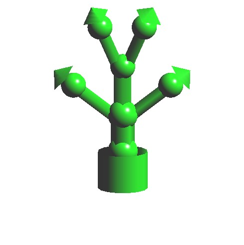
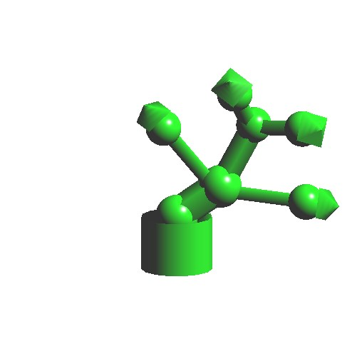
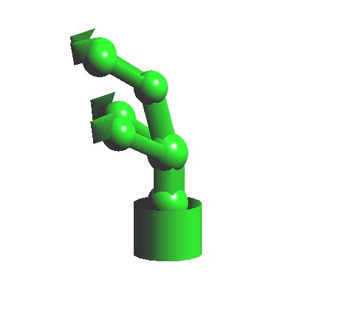

# Robot Arm #

## Usage ##
使用 codeblock 架設 OpenGL 的專案，編譯並執行

## Demo ##

### model ###
以固定形狀的物件進行組合，模型外表如同手臂一樣，並在活動關節處放上圓球模型來讓整體移動變得更加平滑自然，可使用不同按鍵與選單改變模型位置與觀察者視角

### swing ###
使機械手臂的可活動部分無規則的進行擺動

### grab ###
使特定關節部分移動與旋轉，來模擬抓握

## Motivation ##
了解在電腦圖學領域內物件是如何繪製、移動